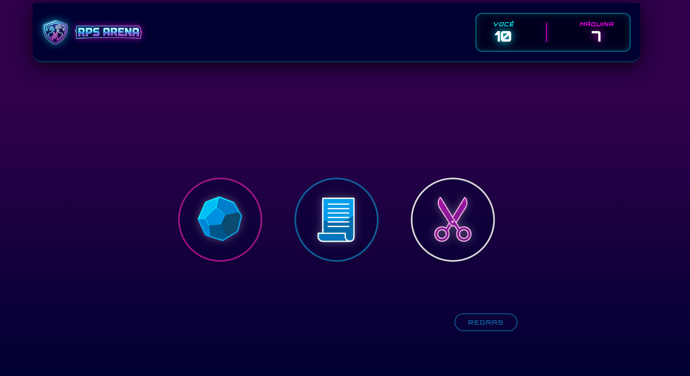
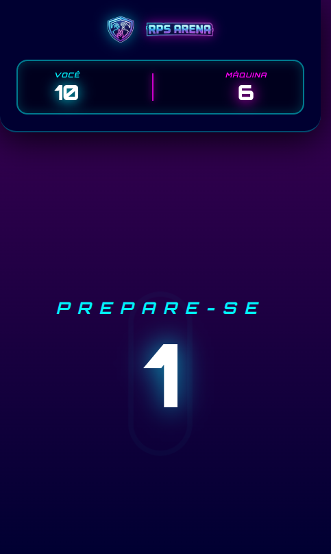
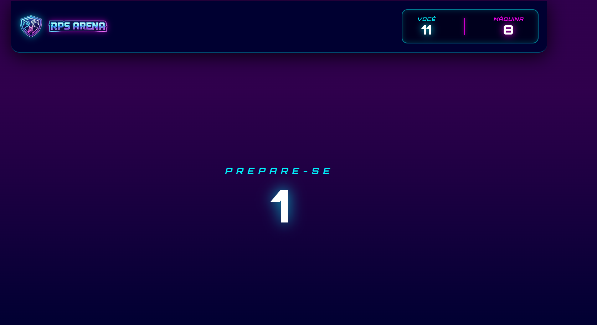
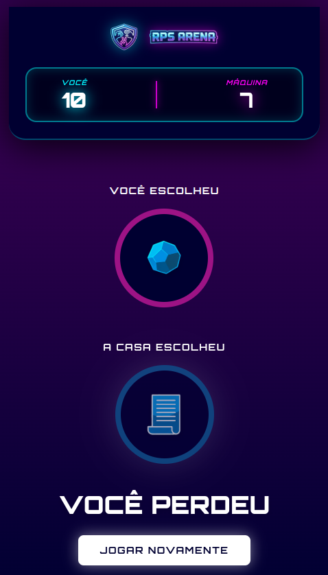
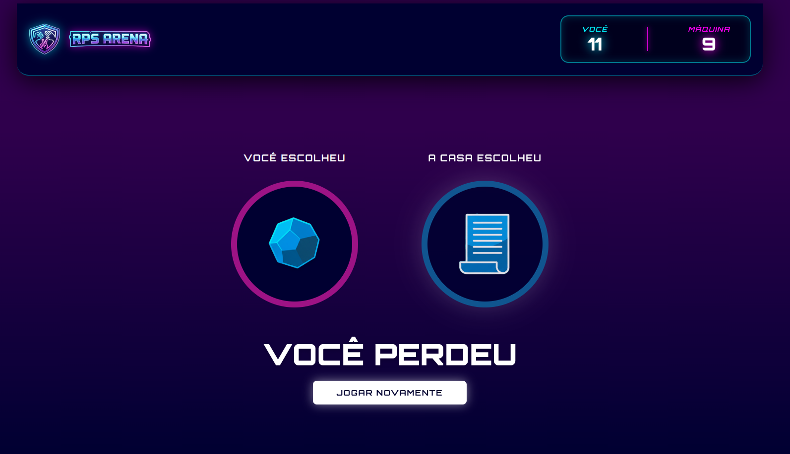
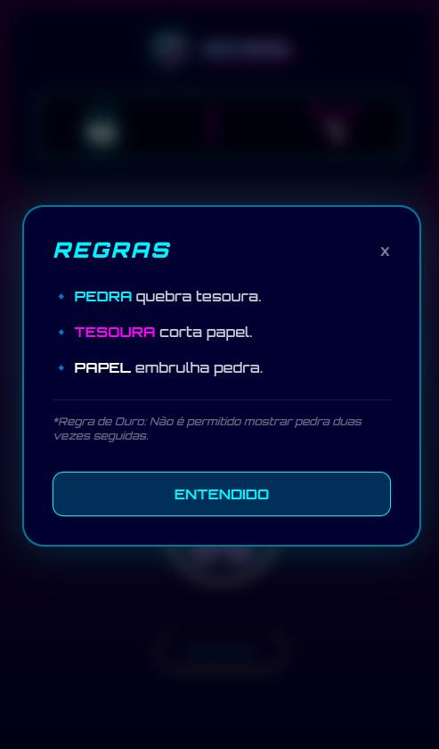

# ✊🖐️✌️ RPS Arena - Jokenpo Pro

> Um WebApp moderno de Pedra, Papel e Tesoura desenvolvido com **React** e **Tailwind CSS v4**, focado em performance, arquitetura limpa e experiência do usuário (UX) com estética Gamer/Neon.


## Sobre o Projeto

Este projeto foi desenvolvido como parte de um estudo aprofundado sobre **Frontend Moderno** e **Lógica de Sistemas**. O objetivo não foi apenas criar um jogo, mas implementar padrões profissionais de desenvolvimento, incluindo gerenciamento de estado complexo, otimização de renderização e design responsivo *Mobile-First*.

### Deploy
🔗 **[Clique aqui para ver o projeto online](https://jokenpo-pro.vercel.app/)**

---

## Tecnologias e Decisões Técnicas

Para demonstrar competência técnica alinhada ao mercado atual, foram utilizadas as seguintes abordagens:

* **React (Hooks Avançados):**
    * `useState`: Gerenciamento do placar e estados da interface.
    * `useEffect`: Controle do ciclo de vida (timer da contagem regressiva e lógica de vitória).
    * `useRef`: **Solução de Engenharia** para evitar a "Double Invocation" do React 18 Strict Mode, garantindo que a pontuação não fosse duplicada em ambiente de desenvolvimento.
* **Tailwind CSS v4 (Alpha/Beta):** Utilização da versão mais recente, explorando variáveis nativas de CSS (`@theme`) para dispensar o uso de pré-processadores como Sass.
* **Arquitetura de Máquina de Estados:** O fluxo do jogo não é linear; ele opera como uma State Machine (`idle` → `counting` → `result`), garantindo previsibilidade e facilitando testes.
* **Mobile First Design:** Interface desenvolvida prioritariamente para dispositivos móveis, com adaptação fluida para desktops usando Flexbox e Breakpoints do Tailwind.

---

## Funcionalidades

* **UI/UX Imersiva:** Design estilo "Neon Cyberpunk" com efeitos de *glassmorphism* (vidro), brilho externo (glow) e animações suaves.
* **Score Persistente:** O placar atualiza em tempo real conforme o resultado das rodadas.
* **Lógica de Jogo Robusta:** Algoritmo que gera escolhas aleatórias para a CPU e determina o vencedor instantaneamente.
* **Modal de Regras:** Janela interativa para consulta rápida das regras, com controle de visibilidade.
* **Responsividade Total:** Layout adaptável que empilha elementos em telas pequenas e expande em monitores largos.

---

## Screenshots

| Mobile View | Desktop View |
|:---:|:---:|
|  |  |
|  |  |
|  |  |
|  |  |
---

## Como rodar o projeto localmente

Pré-requisitos: Node.js instalado.

```bash
# 1. Clone o repositório
git clone https://github.com/pablomigueldias/JokenpoPro

# 2. Entre na pasta
cd jokenpo-pro

# 3. Instale as dependências
npm install

# 4. Rode o servidor de desenvolvimento
npm run dev
